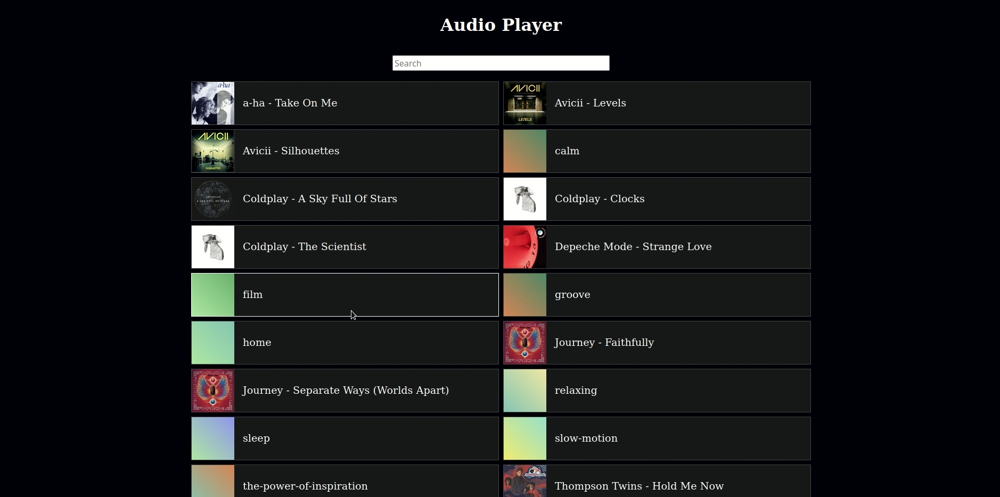
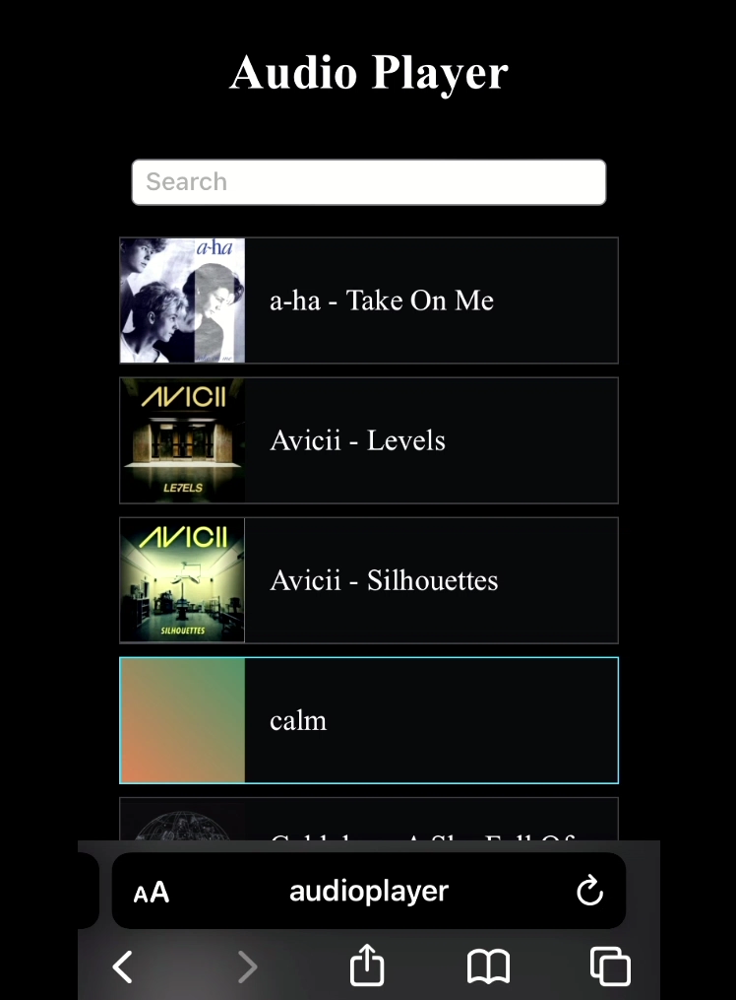

# audioplayer
Audio Player Web Application

My focus for designing the application was to make a simple interface for playing and listening to audio files using a web browser.

Simply click the sound file rectangle to play or pause the file.

Type into the search box to filter the results.

That's it!

All of the music played in this video was sourced from here: "https://pixabay.com/users/music_for_videos-26992513/"
and all credit goes to the original artist.

<br>




Demo: https://www.youtube.com/playlist?list=PLDlLzU2EysQgOo0_zDpzyuDrJyb8KUrsj

<br>

## Dependencies

The Java Runtime Environment is required. Version 11.0.16 was used for this project. Other versions may also work.

Sqlite3 is required. Version 3.34.1 was used for this project. Other verions may also work.

Apache Tomcat is required.

Version 9.0.106 was used for this project (apache-tomcat-9.0.106.tar.gz) though other versions may work as well.

The Sqlite JDBC library is also required. Version 3.50.1.0 was used for this project (sqlite-jdbc-3.50.1.0.jar).

The scripts used require bash.

<br>

## Setup

Navigate into the Apache Tomcat top-level directory.

Copy the Sqlite JDBC library into the "lib" directory.

Now recursively copy the "bin" and "webapps" directories and the "run.sh" file into the Apache Tomcat top-level directory, 
effectively merging these files into the directory.

Navigate into the "./webapps/site/db/" directory and run:

>```./create_database.sh```

This will initialize an empty database in this directory.

Navigate back to the top-level of the Apache Tomcat directory.

Copy any audio files into the "./webapps/site/content/mp3/" directory.

Copy any images you would like to use as artwork into the "./webapps/site/content/images/" directory.

Any images whose file names match audio files in the "./webapps/site/content/mp3/" directory will
automatically be imported into the database in the following step. If the image name does not match the audio file
(not including the file extension) then the image path will have to be entered into the database manually.

For example, an audio file with the path "./webapps/site/content/mp3/audio.mp3" should have a corresponding 
artwork file with the path "./webapps/site/content/images/audio.png" or "./webapps/site/content/images/audio.jpg".

Now navigate into the "./webapps/site/db/" directory and run:

>```./populate_songs.sh```

This script will import the audio files added from before into the database along with any corresponding 
artwork with matching names (not including the file extension).

At this point the database should be populated with all of the audio and artwork file paths and the web app is ready to be run.

<br>

## Run the Program

From the top-level of the Apache Tomcat project directory, run:

>```"./run.sh"```

By default, the Apache Tomcat server should run on port 8080 on the localhost.

Navigate to this port on the localhost (or the appropriate port if you have changed the default) and you can now use the web app!

To shutdown the server, run:

>```"./stop.sh"```
